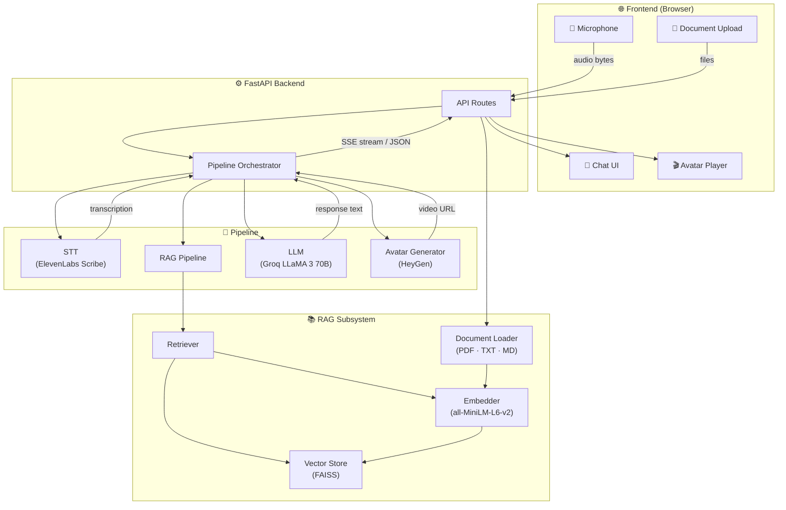
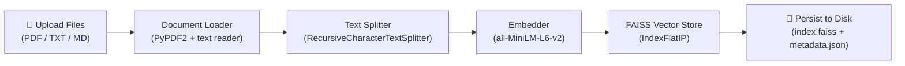
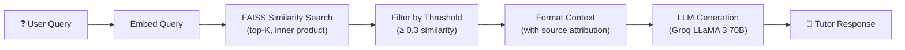
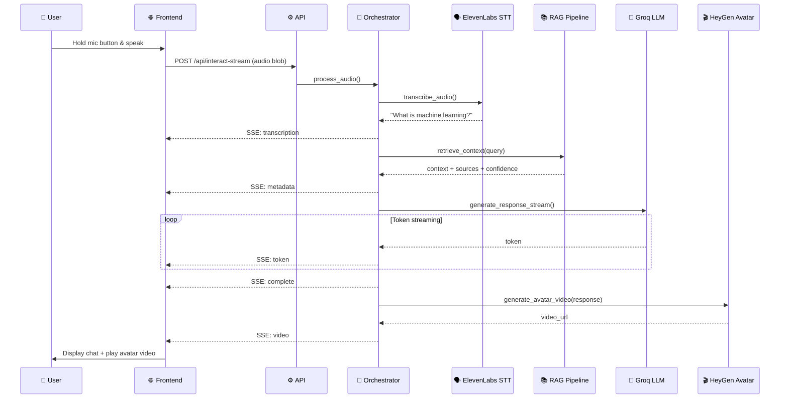

<div align="center">

# 🎓 AI Avatar Tutor

**An AI-powered tutoring system with voice interaction, document-grounded answers, and talking avatar video responses.**

[](https://python.org)
[](https://fastapi.tiangolo.com)
[](LICENSE)
[](Dockerfile)

</div>

---

## 📖 Overview

**AI Avatar Tutor** is a full-stack AI tutoring application that lets students interact with an intelligent tutor through voice. The system:

1. **Listens** — Captures the student's spoken question via the browser microphone.
2. **Understands** — Transcribes speech to text using ElevenLabs Scribe.
3. **Retrieves** — Searches uploaded study materials using a RAG (Retrieval-Augmented Generation) pipeline backed by FAISS.
4. **Reasons** — Generates a grounded, educational answer using Groq's LLaMA 3 70B model.
5. **Presents** — Delivers the response as text in a chat interface **and** as a talking avatar video via HeyGen.

### Who is this for?

- **Students** who want an interactive, AI-powered study companion.
- **Educators** who want to provide 24/7 AI tutoring grounded in their own course materials.
- **Developers** interested in building end-to-end voice + RAG + avatar AI pipelines.

---

## ✨ Features

| Feature | Description |
|---------|-------------|
| 🎤 **Voice Interaction** | Press-and-hold microphone button with real-time audio visualization |
| 📄 **Document-Grounded Answers** | Upload PDF, TXT, or MD files — answers are grounded in your materials |
| 🤖 **LLM-Powered Responses** | Groq LLaMA 3 70B generates clear, educational answers |
| 🎬 **Talking Avatar** | HeyGen generates a video of a talking avatar delivering the response |
| ⚡ **Streaming Responses** | Real-time token streaming via Server-Sent Events (SSE) |
| 🌐 **Bilingual Support** | Automatic language detection for English and Arabic |
| 💬 **Conversation Memory** | Maintains context across turns with automatic history summarization |
| 📊 **Confidence Scoring** | Shows RAG retrieval confidence so students know answer reliability |
| 📁 **Document Management** | Upload, list, and delete documents through the web interface |
| 🐳 **Docker Ready** | Single-command deployment with Docker Compose |
| 🔄 **Response Caching** | In-memory cache with configurable TTL to avoid redundant API calls |
| 🩺 **Health Monitoring** | Built-in health check endpoint for monitoring |

---

## 🏗️ Architecture



### Request Flow

1. **Audio Capture** → Browser records audio via MediaRecorder API.
2. **Speech-to-Text** → ElevenLabs Scribe v1 transcribes the audio.
3. **Language Detection** → Unicode analysis + langdetect determines English or Arabic.
4. **RAG Retrieval** → Query is embedded with MiniLM-L6, top-K similar chunks are retrieved from FAISS.
5. **LLM Generation** → Groq LLaMA 3 generates a response using the retrieved context + conversation history.
6. **Avatar Video** → HeyGen creates a talking avatar video from the response text.
7. **Delivery** → Response is streamed token-by-token via SSE, with avatar video URL sent on completion.

---

## 📁 Project Structure

```
ai-avatar-tutor/
├── main.py                     # Application entry point — creates FastAPI app, initializes RAG
├── Dockerfile                  # Docker image configuration
├── docker-compose.yml          # Docker Compose orchestration
├── requirements.txt            # Python dependencies (pip)
├── pyproject.toml              # Project metadata and dependencies (uv/pip)
├── .env.example                # Environment variable template
├── .gitignore                  # Git ignore rules
│
├── api/                        # FastAPI API layer
│   ├── __init__.py
│   ├── routes.py               # All API endpoint definitions
│   └── schemas.py              # Pydantic request/response models
│
├── pipeline/                   # AI pipeline components
│   ├── __init__.py
│   ├── orchestrator.py         # Coordinates STT → RAG → LLM → Avatar flow
│   ├── stt.py                  # Speech-to-Text via ElevenLabs API
│   ├── llm.py                  # LLM response generation via Groq API
│   ├── rag.py                  # High-level RAG pipeline interface
│   └── tts_avatar.py           # Avatar video generation via HeyGen API
│
├── rag/                        # RAG subsystem
│   ├── __init__.py
│   ├── document_loader.py      # Loads and chunks PDF, TXT, MD files
│   ├── embedder.py             # Sentence-transformer embedding with caching
│   ├── vector_store.py         # FAISS index with disk persistence
│   └── retriever.py            # Semantic search with relevance filtering
│
├── config/
│   └── settings.py             # Pydantic BaseSettings configuration
│
├── utils/
│   ├── __init__.py
│   ├── logger.py               # Rotating file + console logging
│   └── helpers.py              # Language detection, text utilities
│
├── prompts/
│   └── system_prompt.txt       # LLM system prompt template
│
├── frontend/                   # Browser-based UI (served by FastAPI)
│   ├── index.html              # Main HTML page
│   ├── app.js                  # Application logic (recording, chat, uploads)
│   └── style.css               # Dark theme stylesheet
│
├── docs/                       # Source documents for RAG (user-provided)
├── vector_store/               # FAISS index files (auto-generated)
└── logs/                       # Application log files (auto-generated)
```

---

## 🛠️ Technology Stack

| Component | Technology | Purpose |
|-----------|-----------|---------|
| **Backend** | [FastAPI](https://fastapi.tiangolo.com) 0.104.1 | Async API server with auto-generated OpenAPI docs |
| **ASGI Server** | [Uvicorn](https://www.uvicorn.org) 0.24.0 | High-performance ASGI server |
| **LLM** | [Groq](https://groq.com) (LLaMA 3 70B) | Ultra-fast LLM inference |
| **Speech-to-Text** | [ElevenLabs](https://elevenlabs.io) Scribe v1 | High-accuracy multilingual transcription |
| **Avatar Video** | [HeyGen](https://heygen.com) v2 API | AI-generated talking avatar videos |
| **Embeddings** | [sentence-transformers](https://sbert.net) (all-MiniLM-L6-v2) | Dense text embeddings for semantic search |
| **Vector Store** | [FAISS](https://github.com/facebookresearch/faiss) (faiss-cpu 1.7.4) | Fast similarity search with inner product |
| **Document Parsing** | [PyPDF2](https://pypdf2.readthedocs.io) 3.0.1 | PDF text extraction |
| **Text Chunking** | [LangChain](https://langchain.com) Text Splitters | Recursive character-based chunking |
| **Language Detection** | [langdetect](https://github.com/Mimino666/langdetect) 1.0.9 | Automatic language identification |
| **Configuration** | [Pydantic Settings](https://docs.pydantic.dev/latest/concepts/pydantic_settings/) 2.1.0 | Type-safe settings from `.env` files |
| **HTTP Client** | [httpx](https://www.python-httpx.org) 0.25.2 | Async HTTP client for API calls |
| **Frontend** | Vanilla HTML / CSS / JavaScript | No-framework, lightweight browser UI |

| **Containerization** | [Docker](https://docker.com) + Docker Compose | Production-ready deployment |

---

## 🚀 Installation

### Prerequisites

- **Python 3.10** or higher
- **pip** or **uv** package manager
- A modern web browser with microphone access
- API keys for **Groq** and **ElevenLabs** (required), **HeyGen** (optional)

### System Requirements

| Resource | Minimum | Recommended |
|----------|---------|-------------|
| RAM | 4 GB | 8 GB (for embedding model) |
| Storage | 2 GB | 5 GB |
| OS | Linux, macOS, Windows | — |

### Step-by-step Setup

**1. Clone the repository**

```bash
git clone https://github.com/MohanadMahran/ai-avatar-tutor.git
cd ai-avatar-tutor
```

**2. Create a virtual environment**

```bash
python -m venv .venv

# Linux / macOS
source .venv/bin/activate

# Windows
.venv\Scripts\activate
```

**3. Install dependencies**

```bash
pip install -r requirements.txt
```

Or using [uv](https://docs.astral.sh/uv/):

```bash
uv sync
```

**4. Configure environment variables**

```bash
cp .env.example .env
```

Edit `.env` and add your API keys (see [Environment Variables](#-environment-variables) below).

**5. Obtain API Keys**

<details>
<summary><strong>Groq API Key</strong> (Required)</summary>

1. Go to [console.groq.com](https://console.groq.com/)
2. Sign up or log in
3. Navigate to **API Keys**
4. Create a new API key
5. Paste it as `GROQ_API_KEY` in your `.env` file
</details>

<details>
<summary><strong>ElevenLabs API Key</strong> (Required)</summary>

1. Go to [elevenlabs.io](https://elevenlabs.io/)
2. Sign up or log in
3. Go to **Profile Settings → API Keys**
4. Copy your API key to `ELEVENLABS_API_KEY` in `.env`
5. Choose a voice and copy its ID to `ELEVENLABS_VOICE_ID`
</details>

<details>
<summary><strong>HeyGen API Key</strong> (Optional — for avatar video)</summary>

1. Go to [app.heygen.com](https://app.heygen.com/)
2. Sign up or log in
3. Go to **Settings → API**
4. Generate and copy your API key to `HEYGEN_API_KEY` in `.env`
5. Choose an avatar and copy its ID to `HEYGEN_AVATAR_ID`
6. Optionally set `HEYGEN_VOICE_ID` for a specific voice

> **Note:** If HeyGen keys are not configured, the app works in text-only mode without avatar video.
</details>

**6. Add study documents**

Place your PDF, TXT, or Markdown files in the `docs/` folder:

```bash
cp your_textbook.pdf docs/
cp your_notes.md docs/
```

Documents are automatically indexed on first application startup.

**7. Run the application**

```bash
python main.py
```

The application will be available at **http://localhost:8000**.

---

## 🐳 Docker Deployment

```bash
# Build and start
docker-compose up --build

# Run in background
docker-compose up -d --build

# View logs
docker-compose logs -f

# Stop
docker-compose down
```

The Docker setup mounts `docs/`, `vector_store/`, and `logs/` as volumes for data persistence.

---

## 📘 Usage

1. **Open** the web interface at [http://localhost:8000](http://localhost:8000).
2. **Upload** study documents using the document panel on the right (drag & drop or click to browse).
3. **Press and hold** the microphone button to ask a question by voice.
4. **Wait** for the pipeline to process — you'll see live progress indicators for each stage.
5. **Read** the streamed text response in the chat and **watch** the avatar video when it loads.
6. **Continue** the conversation — the tutor remembers previous context.

---

## ⚙️ Configuration

All settings are managed through environment variables loaded from a `.env` file. Every setting has a sensible default.

### 🔑 Environment Variables

#### API Keys

| Variable | Required | Description |
|----------|----------|-------------|
| `GROQ_API_KEY` | ✅ Yes | API key for Groq LLM service |
| `GROQ_MODEL` | No | Groq model identifier (default: `llama3-70b-8192`) |
| `ELEVENLABS_API_KEY` | ✅ Yes | API key for ElevenLabs speech services |
| `ELEVENLABS_VOICE_ID` | No | ElevenLabs voice ID for TTS |
| `HEYGEN_API_KEY` | No | API key for HeyGen avatar video generation |
| `HEYGEN_AVATAR_ID` | No | HeyGen avatar ID |
| `HEYGEN_VOICE_ID` | No | HeyGen voice ID for avatar speech |

#### RAG Settings

| Variable | Default | Description |
|----------|---------|-------------|
| `EMBEDDING_MODEL` | `sentence-transformers/all-MiniLM-L6-v2` | HuggingFace model for text embeddings |
| `VECTOR_STORE_PATH` | `./vector_store` | Directory for FAISS index persistence |
| `DOCS_PATH` | `./docs` | Directory containing source documents |
| `CHUNK_SIZE` | `500` | Characters per document chunk |
| `CHUNK_OVERLAP` | `50` | Overlapping characters between chunks |
| `TOP_K_RESULTS` | `4` | Number of top results to retrieve |
| `RELEVANCE_THRESHOLD` | `0.3` | Minimum cosine similarity score (0.0–1.0) |

#### Application Settings

| Variable | Default | Description |
|----------|---------|-------------|
| `APP_HOST` | `0.0.0.0` | Server bind address |
| `APP_PORT` | `8000` | Server port number |
| `DEBUG` | `true` | Enable debug mode with auto-reload |
| `MAX_CONVERSATION_HISTORY` | `10` | Max conversation turns before summarization |

#### Audio Settings

| Variable | Default | Description |
|----------|---------|-------------|
| `AUDIO_SAMPLE_RATE` | `16000` | Audio sample rate in Hz |
| `AUDIO_CHANNELS` | `1` | Number of audio channels (mono) |
| `MAX_AUDIO_DURATION_SECONDS` | `60` | Maximum recording duration in seconds |

#### Cache Settings

| Variable | Default | Description |
|----------|---------|-------------|
| `ENABLE_CACHE` | `true` | Enable response caching for identical queries |
| `CACHE_TTL_SECONDS` | `3600` | Cache expiry time in seconds (1 hour) |

---

## 📡 API Documentation

The FastAPI server exposes the following endpoints under the `/api` prefix. Interactive API docs are available at `/docs` (Swagger UI) and `/redoc` when the server is running.

### `POST /api/interact`

Main voice interaction endpoint. Accepts audio, returns transcription, AI response, and avatar video URL.

**Request:** `multipart/form-data`

| Field | Type | Required | Description |
|-------|------|----------|-------------|
| `audio` | file | Yes | Audio file (webm, wav, mp3, ogg). Max 10 MB. |
| `generate_video` | boolean | No | Whether to generate avatar video (default: `true`) |

**Response:** `200 OK`

```json
{
  "transcription": "What is machine learning?",
  "response_text": "Machine learning is a branch of AI that...",
  "video_url": "https://resource.heygen.com/video/...",
  "confidence": 0.85,
  "language": "en",
  "sources": ["textbook.pdf"],
  "timing": { "stt": 1.2, "rag": 0.3, "llm": 2.1, "avatar": 15.0, "total": 18.6 }
}
```

---

### `POST /api/interact-text`

Text-based interaction endpoint (skips speech-to-text).

**Request:** `application/json`

```json
{
  "text": "Explain neural networks",
  "generate_video": true
}
```

**Response:** Same schema as `POST /api/interact`.

---

### `POST /api/interact-stream`

Streaming interaction endpoint. Returns tokens as they are generated via Server-Sent Events (SSE).

**Request:** `multipart/form-data` (same as `/api/interact`)

**Response:** `text/event-stream` — SSE events with the following types:

| Event Type | Description |
|-----------|-------------|
| `transcription` | Transcribed user query |
| `metadata` | Confidence score, sources, detected language |
| `token` | Individual generated token |
| `complete` | Full response text |
| `video` | Avatar video URL |
| `done` | Stream complete signal |
| `error` | Error message |

---

### `POST /api/upload-docs`

Upload and index document files.

**Request:** `multipart/form-data`

| Field | Type | Required | Description |
|-------|------|----------|-------------|
| `files` | file[] | Yes | One or more document files (PDF, TXT, MD) |

**Response:** `200 OK`

```json
{
  "message": "Successfully processed 2 file(s).",
  "files_processed": 2,
  "total_chunks": 45,
  "filenames": ["chapter1.pdf", "notes.md"]
}
```

---

### `GET /api/health`

System health check.

**Response:** `200 OK`

```json
{
  "status": "healthy",
  "vector_store_loaded": true,
  "documents_indexed": 150,
  "indexed_sources": ["textbook.pdf", "notes.md"]
}
```

---

### `GET /api/docs-list`

List all indexed documents.

**Response:** `200 OK`

```json
{
  "documents": ["textbook.pdf", "notes.md"],
  "total_chunks": 150
}
```

---

### `POST /api/delete-doc`

Delete a document from the vector store and disk.

**Request:** `application/json`

```json
{
  "source_name": "textbook.pdf"
}
```

**Response:** `200 OK`

```json
{
  "message": "Document 'textbook.pdf' deleted successfully.",
  "success": true
}
```

---

### `DELETE /api/conversation`

Clear the conversation history and response cache.

**Response:** `200 OK`

```json
{
  "message": "Conversation history cleared successfully.",
  "success": true
}
```

---

### `GET /api/conversation-history`

Retrieve the current conversation history.

**Response:** `200 OK`

```json
{
  "history": [
    { "role": "user", "content": "What is deep learning?" },
    { "role": "assistant", "content": "Deep learning is a subset of machine learning..." }
  ]
}
```

---

## 🔄 Data Pipeline

### Document Ingestion



1. **Loading** — `DocumentLoader` reads PDF pages (with TOC detection/skip), TXT, and MD files.
2. **Chunking** — `RecursiveCharacterTextSplitter` splits text into 500-character chunks with 50-character overlap at natural boundaries (paragraphs, sentences, words).
3. **Embedding** — `Embedder` converts chunks to 384-dimensional vectors using `all-MiniLM-L6-v2` with L2 normalization.
4. **Storage** — `VectorStore` adds normalized vectors to a FAISS `IndexFlatIP` index and persists both the index and document metadata to disk.

### Retrieval & Generation



1. **Embedding** — The query is embedded with the same model used for document chunks.
2. **Search** — FAISS performs inner-product similarity search over all indexed chunks.
3. **Filtering** — Results below the relevance threshold (default 0.3) are discarded.
4. **Context Formatting** — Relevant chunks are formatted with source and page attribution.
5. **Generation** — The LLM receives the system prompt, conversation history, context, and query to produce a grounded response.

---

## 🔄 Application Workflow



---

## 📦 Key Dependencies

| Package | Purpose |
|---------|---------|
| `fastapi` + `uvicorn` | Async web framework and ASGI server |
| `groq` | Official Groq Python SDK for LLM inference |
| `httpx` | Async HTTP client for ElevenLabs and HeyGen API calls |
| `sentence-transformers` | Pre-trained models for text embedding |
| `faiss-cpu` | Facebook's vector similarity search library |
| `PyPDF2` | PDF text extraction |
| `langchain` + `langchain-text-splitters` | Document chunking with recursive splitting |
| `pydantic` + `pydantic-settings` | Data validation and environment configuration |
| `langdetect` | Language identification |
| `torch` + `transformers` | PyTorch runtime for sentence-transformers |


---

## 🧑‍💻 Development Guide

### Code Style

- Python code follows PEP 8 conventions.
- All modules and public functions include docstrings.
- Type hints are used throughout the Python codebase.

### Adding New Document Types

To support a new file format, add a `_load_<format>` method in `rag/document_loader.py` and register the extension in `load_file()`.

### Adding a New Pipeline Stage

1. Create a new module in `pipeline/` with a service class.
2. Initialize it in `PipelineOrchestrator.__init__()`.
3. Integrate it into the `process_audio()` and `process_text()` flows.
4. Add timing instrumentation.

### Contributing

1. Fork the repository
2. Create a feature branch (`git checkout -b feature/my-feature`)
3. Make your changes
4. Submit a pull request

---

## 🔧 Troubleshooting

<details>
<summary><strong>ModuleNotFoundError: No module named 'sentence_transformers'</strong></summary>

```bash
pip install sentence-transformers --no-cache-dir
```

This package has heavy dependencies (PyTorch, transformers). Ensure you have sufficient disk space (~2 GB).
</details>

<details>
<summary><strong>FAISS index not found</strong></summary>

This is expected on first run. The vector store is created automatically when you:
- Upload documents through the web interface, or
- Place files in the `docs/` folder and restart the application.
</details>

<details>
<summary><strong>Microphone access denied</strong></summary>

- Ensure your browser has microphone permissions enabled.
- The app must be served over HTTPS or from `localhost`.
- Check your OS-level microphone permissions.
</details>

<details>
<summary><strong>Groq API rate limit exceeded</strong></summary>

The free Groq tier has rate limits. Solutions:
- Wait 60 seconds and retry (the app has built-in retry with exponential backoff).
- Upgrade your Groq plan for higher limits.
- Enable response caching (`ENABLE_CACHE=true`) to reduce duplicate calls.
</details>

<details>
<summary><strong>HeyGen video generation timeout</strong></summary>

HeyGen video generation typically takes 30–60 seconds. If it times out:
- Check your HeyGen API quota and plan limits.
- The system will still deliver the text response even if avatar generation fails.
- Try setting `generate_video=false` in the API request to skip avatar generation.
</details>

<details>
<summary><strong>Empty transcription returned</strong></summary>

- Ensure your audio recording is long enough (hold the button for at least 1–2 seconds).
- Check that your ElevenLabs API key is valid and has remaining quota.
- Verify microphone is working by testing in another application.
</details>

---

## 🚀 Future Improvements

- [ ] **WebSocket real-time interaction** — Replace SSE with bidirectional WebSocket for lower latency.
- [ ] **Multi-model LLM support** — Allow switching between Groq, OpenAI, Anthropic, and local models.
- [ ] **User authentication** — Add user accounts with per-user document collections and history.
- [ ] **PDF OCR support** — Use OCR for scanned PDFs that don't have extractable text.
- [ ] **Hybrid search** — Combine dense vector search with BM25 sparse retrieval for better accuracy.
- [ ] **Persistent conversation history** — Store conversations in a database instead of in-memory.
- [ ] **Fine-tuned embeddings** — Domain-specific embedding model fine-tuning for better retrieval.
- [ ] **Response evaluation** — Automated grounding checks to verify answers against source documents.
- [ ] **Multi-language expansion** — Extend beyond English and Arabic to support more languages.
- [ ] **Admin dashboard** — Analytics on usage, popular questions, and retrieval quality metrics.

---

## 📄 License

This project is licensed under the [MIT License](LICENSE).

---

## 🙏 Credits

Built with these excellent open-source projects and services:

- [FastAPI](https://fastapi.tiangolo.com) — Modern, fast web framework for building APIs
- [Groq](https://groq.com) — Ultra-fast LLM inference
- [ElevenLabs](https://elevenlabs.io) — AI speech synthesis and transcription
- [HeyGen](https://heygen.com) — AI avatar video generation
- [FAISS](https://github.com/facebookresearch/faiss) — Efficient similarity search (Meta AI)
- [sentence-transformers](https://sbert.net) — State-of-the-art text embeddings
- [LangChain](https://langchain.com) — LLM application framework
- [PyPDF2](https://pypdf2.readthedocs.io) — PDF processing
- [Pydantic](https://pydantic.dev) — Data validation